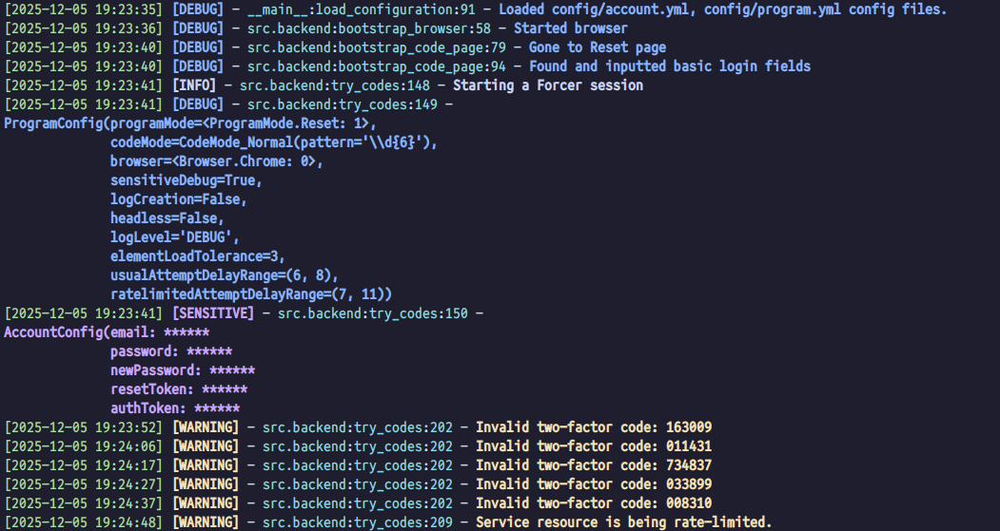

# Discord-OTP-Forcer
This is a Selenium and Python based Discord TOTP forcer. It attempts to brute force randomly generated 6 or 8 digit codes with a random delay between each attempt.

*Look at him go!*

Instructions on how to setup and use this program can be found on the [wiki](https://github.com/Derpitron/Discord-OTP-Forcer/wiki/How-to-setup-and-use)

> [!NOTE]  
> Going forward I won't maintain this program often. I don't have the time or inclination to maintain this for more than my personal needs anymore. If the community wishes they can write their own bug fixes and features and add pull requests, and I'll merge them in here. Thanks to the contributors and people who help each other out in this. You've been real ones

# Features
- Brute forces 6 digit TOTP codes (1 million possible codes) and 8 digit Backup codes (2.82 trillion possible codes)
- If you know part of a valid backup code, you can fill it in using a [regex template.](https://docs.python.org/3/library/re.html#regular-expression-syntax)
- Ratelimit avoidance (Cooldown between every code attempt)
- Can brute force Password Reset page's TOTP/Backup codes.
- Waits for you to complete the hCaptcha
- Saves your account token to a file if it succesfully logs in, no lost account just because you accidentally closed the program/browser
- Automatically prints useful info on session stats like time taken, no. of codes attempted, when the program finishes
- Blocks analytics URLs such as Cloudflare logging, Discord Science, and Sentry.io
- Robust easy to read log formatting
- User friendly

# How to use:
See this repo's Github wiki or the `docs` folder for this section. https://github.com/Derpitron/Discord-OTP-Forcer/wiki/How-to-setup-and-use

# Dependencies
- Google Chrome
- Python >= 3.13
- All the libraries in `requirements.txt`

# Why did I make this?
In December 2021, I lost access to my passwords and OTP list due to a file syncing issue. I was able to recover most of the credentials, except for my Discord Alt. When I contacted Discord Support, they informed me that due to their security policy, they could not disable 2FA for that account, which while it is understandable, is unfortunate. As a proof-of-concept program, I hacked together this crude script which simply brute forces randomly generated 6 digit numbers to the Discord login's TOTP field.

# Known Issues
- Depends on HTML element class names, and en-US localised strings on the screen in order to detect failure/success

# Credits
- [SpaghettDev](https://github.com/SpaghettDev) for their [frick-discord-2fa](https://github.com/SpaghettDev/frick-discord-2fa) script, which gave me the base for the codegen.py and textcolor.py libraries. This program wouldn't exist without his inspiration ❤️
- [Luminaex](https://github.com/Luminaex) for implementing 8-char Backup OTP code brute-forcing, Password Reset OTP forcing, various bug fixes, and maintaining this program when I couldn't ❤️
- [progressEdd](https://github.com/progressEdd) for fixing a chromedriver installation bug a while ago ❤️
- [nyathea](https://github.com/nyathea) for adding a missing config option ❤️
- [ultrafunkamsterdam](https://github.com/ultrafunkamsterdam) for making and maintaining the `undetected-chromedriver` library that this program uses. ❤️

---
# Disclaimer
    Copyright (C) Derpitron 2025
    This program is free software: you can redistribute it and/or modify
    it under the terms of the GNU Affero General Public License as published by
    the Free Software Foundation, either version 3 of the License, or
    (at your option) any later version.

    This program is distributed in the hope that it will be useful,
    but WITHOUT ANY WARRANTY; without even the implied warranty of
    MERCHANTABILITY or FITNESS FOR A PARTICULAR PURPOSE.  See the
    GNU Affero General Public License for more details.

    You should have received a copy of the GNU Affero General Public License
    along with this program.  If not, see <https://www.gnu.org/licenses/>.

Tldr; I am not responsible for anything you do with this script, and I do not condone (but cannot prevent) the usage of this script to hack into accounts which you do not properly own. The onus is on you to not be evil. Read the [License](https://github.com/Derpitron/Discord-OTP-Forcer/blob/main/LICENSE) for full information on your rights and responsibilities which pertain to this program. 
