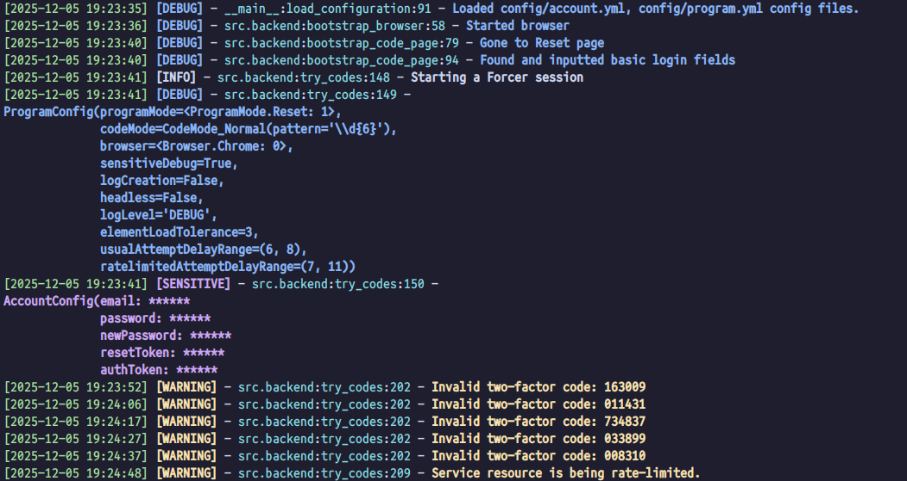

# Discord-OTP-Forcer
This is a Selenium and Python-based Discord TOTP forcer. It attempts to brute-force randomly generated 6 or 8-digit codes with a random delay between each attempt.

*Look at him go!*

> [!NOTE]
> This program has now shifted to a community-based maintenance model. Anyone can contribute by forking the project, submitting pull requests, creating tutorials or updating documentation. However, no guarantee is provided regarding its security or functionality.

## Features
- Can brute force 6-digit TOTP codes (1 million possible codes) or 8-digit backup codes (2.82 trillion possible codes) on both the standard login page and the password reset page
- If you know part of a valid backup code, you can fill it in using a [regular expression template](https://docs.python.org/3/library/re.html#regular-expression-syntax)
- Avoids rate limiting with a configurable cooldown between each code attempt
- Waits for you to complete the CAPTCHA, if necessary
- Saves your account token to a file if the code was correct and it successfully logs you in (no lost account just because you accidentally closed the program/browser!)
- Automatically prints useful info such as time taken, number of codes attempted and when the program finishes
- Blocks analytics URLs such as Cloudflare Analytics, Discord Science and Sentry.io
- Robust and easy to read log formatting
- User-friendly and easy to use with clear status and error messages

## How to use
Instructions on how to set up and use this program can be found on the new [documentation site](https://discord-otp-forcer.codeberg.page/en/user/setup/) or the Wiki tab in the repository.

There are also video tutorials for [Windows](https://www.youtube.com/watch?v=v4skgYVmvQg) and [macOS](https://www.youtube.com/watch?v=H1f_exxU-Nc) if you prefer. A lot of information in both of these tutorials overlap and the same core principle applies to all operating systems. This means that if you find some parts of either video more helpful, it is more than likely that you can refer to both.

## Prerequisites
- A Chromium-based browser (most mainstream ones are supported)
- Python 3.13 or later
- All the libraries in `dependencies.txt`/`pyproject.toml`

## Why did I make this?
In December 2021, I lost access to my passwords and OTP list due to a file syncing issue. I was able to recover most of the credentials, except for my Discord Alt. When I contacted Discord Support, they informed me that due to their security policy, they could not disable 2FA for that account, which while it is understandable, is unfortunate. As a proof-of-concept program, I hacked together this crude script which simply brute forces randomly generated 6-digit numbers to the Discord login's TOTP field.

## Credits
- [Derpitron](https://codeberg.org/derpitron): Creator and maintainer from April 2022 to March 2026
- [SpaghettDev](https://github.com/SpaghettDev): Creator of [frick-discord-2fa](https://github.com/SpaghettDev/frick-discord-2fa) script. Which gave me the base for the codegen.py and textcolor.py libraries. This program wouldn't exist without his inspiration ❤️
- [Luminaex](https://github.com/Luminaex) for implementing 8-char Backup OTP code brute-forcing, Password Reset OTP forcing, various bug fixes, and maintaining this program when I couldn't ❤️
- [progressEdd](https://github.com/progressEdd) for fixing a ChromeDriver installation bug a while ago ❤️
- [nyathea](https://github.com/nyathea) for adding a missing config option ❤️
- [ultrafunkamsterdam](https://github.com/ultrafunkamsterdam): Creator and former maintainer of the `undetected-chromedriver` library that this program was using before ❤️
- [mdmintz](https://github.com/mdmintz) for making and maintaining [SeleniumBase](https://github.com/seleniumbase/SeleniumBase) library that this program relies on!
- [MicXDev](https://codeberg.org/MicXDev): Maintainer of the batch files used to manage the program on Windows!
- [inbydev](https://codeberg.org/inbydev): Core maintainer since February 2026

---
## Disclaimer
    Copyright (C) Contributors 2026
    This program is free software: you can redistribute it and/or modify
    it under the terms of the GNU Affero General Public License as published by
    the Free Software Foundation, either version 3 of the License or
    (at your option) any later version.

    This program is distributed in the hope that it will be useful,
    but WITHOUT ANY WARRANTY; without even the implied warranty of
    MERCHANTABILITY or FITNESS FOR A PARTICULAR PURPOSE. See the
    GNU Affero General Public License for more details.

    You should have received a copy of the GNU Affero General Public License
    along with this program. If not, see <https://www.gnu.org/licenses/>.

TL;DR: I am not responsible for anything you do with this script and I do not condone (but cannot prevent) the usage of this script to hack into accounts which you do not properly own. The onus is on you to not be evil. Read the [licence](https://codeberg.org/Discord-OTP-Forcer/Discord-OTP-Forcer/src/branch/main/LICENSE) for full information on your rights and responsibilities which pertain to this program.
